# 🏗️ Pharmacy Inventory System - UML Class Diagram

## Package Structure Overview

```
com.pharmacy
├── models/          (Domain Objects)
├── storage/         (Data Access Layer)
├── logic/           (Business Logic Layer)
├── ui/              (Presentation Layer)
└── utils/           (Utility Classes)
```

## Detailed UML Class Diagram

```mermaid
classDiagram
    %% ==================== MODELS PACKAGE ====================
    namespace models {
        class Drug {
            -String code
            -String name
            -int quantity
            -double price
            -LocalDate expiry
            -List~String~ supplierIds
            +Drug(code, name, quantity, price, expiry, supplierIds)
            +getCode() String
            +getName() String
            +getQuantity() int
            +getPrice() double
            +getExpiry() LocalDate
            +getSupplierIds() List~String~
            +setQuantity(int quantity) void
            +setPrice(double price) void
            +toString() String
        }

        class Supplier {
            -String id
            -String name
            -String contact
            -String address
            +Supplier(id, name, contact, address)
            +getId() String
            +getName() String
            +getContact() String
            +getAddress() String
            +toString() String
        }

        class Customer {
            -String id
            -String name
            -String phone
            -String email
            +Customer(id, name, phone, email)
            +getId() String
            +getName() String
            +getPhone() String
            +getEmail() String
            +toString() String
        }

        class Transaction {
            -String transactionId
            -String drugCode
            -String customerId
            -int quantity
            -double totalPrice
            -LocalDateTime timestamp
            +Transaction(transactionId, drugCode, customerId, quantity, totalPrice, timestamp)
            +getTransactionId() String
            +getDrugCode() String
            +getCustomerId() String
            +getQuantity() int
            +getTotalPrice() double
            +getTimestamp() LocalDateTime
            +toString() String
        }
    }

    %% ==================== STORAGE PACKAGE ====================
    namespace storage {
        class DrugStorage {
            -String filePath
            -Map~String, Drug~ drugsMap
            +DrugStorage(filePath)
            +loadDrugs() Map~String, Drug~
            +saveDrugs(Map~String, Drug~ drugs) void
            +addDrug(Drug drug) void
            +updateDrug(Drug drug) void
            +deleteDrug(String code) void
            -parseDrugFromCSV(String csvLine) Drug
            -drugToCSV(Drug drug) String
        }

        class SupplierStorage {
            -String filePath
            -Map~String, Supplier~ suppliersMap
            +SupplierStorage(filePath)
            +loadSuppliers() Map~String, Supplier~
            +saveSuppliers(Map~String, Supplier~ suppliers) void
            +addSupplier(Supplier supplier) void
            +updateSupplier(Supplier supplier) void
            -parseSupplierFromCSV(String csvLine) Supplier
            -supplierToCSV(Supplier supplier) String
        }

        class CustomerStorage {
            -String filePath
            -Map~String, Customer~ customersMap
            +CustomerStorage(filePath)
            +loadCustomers() Map~String, Customer~
            +saveCustomers(Map~String, Customer~ customers) void
            +addCustomer(Customer customer) void
            +updateCustomer(Customer customer) void
            -parseCustomerFromCSV(String csvLine) Customer
            -customerToCSV(Customer customer) String
        }

        class TransactionStorage {
            -String filePath
            -CustomQueue~Transaction~ transactionHistory
            -CustomStack~Transaction~ recentTransactions
            +TransactionStorage(filePath)
            +loadTransactions() void
            +saveTransaction(Transaction transaction) void
            +getTransactionHistory() List~Transaction~
            +getRecentTransactions(int count) List~Transaction~
            -parseTransactionFromCSV(String csvLine) Transaction
            -transactionToCSV(Transaction transaction) String
        }
    }

    %% ==================== LOGIC PACKAGE ====================
    namespace logic {
        class InventoryManager {
            -Map~String, Drug~ drugs
            -DrugStorage drugStorage
            -StockMonitor stockMonitor
            +InventoryManager(DrugStorage storage)
            +addDrug(Drug drug) boolean
            +updateDrug(Drug drug) boolean
            +removeDrug(String code) boolean
            +getDrug(String code) Drug
            +getAllDrugs() List~Drug~
            +updateStock(String code, int quantity) boolean
            +validateDrug(Drug drug) boolean
        }

        class SearchService {
            +linearSearchByCode(List~Drug~ drugs, String code) Drug
            +linearSearchByName(List~Drug~ drugs, String name) List~Drug~
            +binarySearchByCode(List~Drug~ sortedDrugs, String code) Drug
            +searchBySupplier(List~Drug~ drugs, String supplierId) List~Drug~
            +searchExpiringSoon(List~Drug~ drugs, int days) List~Drug~
        }

        class SortService {
            +sortByExpiry(List~Drug~ drugs) List~Drug~
            +sortByPrice(List~Drug~ drugs) List~Drug~
            +sortByQuantity(List~Drug~ drugs) List~Drug~
            +sortByCode(List~Drug~ drugs) List~Drug~
            -merge(List~Drug~ left, List~Drug~ right, Comparator~Drug~ comp) List~Drug~
        }

        class StockMonitor {
            -CustomHeap~Drug~ lowStockHeap
            -int lowStockThreshold
            +StockMonitor(int threshold)
            +addDrug(Drug drug) void
            +updateDrug(Drug drug) void
            +removeDrug(Drug drug) void
            +getLowStockItems() List~Drug~
            +getLowestStockItem() Drug
            +checkExpiringItems(int days) List~Drug~
        }

        class CustomerService {
            -Map~String, Customer~ customers
            -CustomerStorage customerStorage
            +CustomerService(CustomerStorage storage)
            +addCustomer(Customer customer) boolean
            +updateCustomer(Customer customer) boolean
            +getCustomer(String id) Customer
            +getAllCustomers() List~Customer~
        }

        class SupplierService {
            -Map~String, Supplier~ suppliers
            -SupplierStorage supplierStorage
            +SupplierService(SupplierStorage storage)
            +addSupplier(Supplier supplier) boolean
            +updateSupplier(Supplier supplier) boolean
            +getSupplier(String id) Supplier
            +getAllSuppliers() List~Supplier~
        }

        class SalesLogManager {
            -TransactionStorage transactionStorage
            -CustomQueue~Transaction~ salesHistory
            -CustomStack~Transaction~ recentSales
            +SalesLogManager(TransactionStorage storage)
            +recordSale(Transaction transaction) void
            +getSalesHistory() List~Transaction~
            +getRecentSales(int count) List~Transaction~
            +generateSalesReport(LocalDate from, LocalDate to) List~Transaction~
        }

        class PurchaseHistoryService {
            -CustomQueue~Transaction~ purchaseQueue
            +PurchaseHistoryService()
            +addPurchase(Transaction transaction) void
            +getPurchaseHistory() List~Transaction~
            +getPurchasesByCustomer(String customerId) List~Transaction~
            +getPurchasesByDrug(String drugCode) List~Transaction~
        }
    }

    %% ==================== UI PACKAGE ====================
    namespace ui {
        class MenuSystem {
            -InventoryManager inventoryManager
            -SalesLogManager salesManager
            -CustomerService customerService
            -SupplierService supplierService
            +MenuSystem()
            +start() void
            +showMainMenu() void
            -handleMenuChoice(int choice) void
        }

        class DrugMenu {
            -InventoryManager inventoryManager
            -SearchService searchService
            -SortService sortService
            +DrugMenu(InventoryManager manager)
            +showDrugMenu() void
            +addDrugFlow() void
            +searchDrugFlow() void
            +updateDrugFlow() void
            +viewAllDrugsFlow() void
        }

        class SalesMenu {
            -SalesLogManager salesManager
            -InventoryManager inventoryManager
            -CustomerService customerService
            +SalesMenu(SalesLogManager manager)
            +showSalesMenu() void
            +recordSaleFlow() void
            +viewSalesHistoryFlow() void
            +viewRecentSalesFlow() void
        }

        class ReportMenu {
            -InventoryManager inventoryManager
            -SalesLogManager salesManager
            -StockMonitor stockMonitor
            +ReportMenu(InventoryManager manager)
            +showReportMenu() void
            +generateStockReport() void
            +generateSalesReport() void
            +generateExpiryReport() void
            +generateLowStockReport() void
        }

        class BaseMenu {
            <<abstract>>
            #ConsoleHelper consoleHelper
            +BaseMenu()
            +displayMenu() void
            +getUserChoice() int
            #validateInput(String input) boolean
        }

        class ConsoleHelper {
            +printSuccess(String message) void
            +printError(String message) void
            +printWarning(String message) void
            +printInfo(String message) void
            +readString(String prompt) String
            +readInt(String prompt) int
            +readDouble(String prompt) double
            +clearScreen() void
            +pressEnterToContinue() void
        }
    }

    %% ==================== UTILS PACKAGE ====================
    namespace utils {
        class CustomHeap~T~ {
            -List~T~ heap
            -Comparator~T~ comparator
            +CustomHeap(Comparator~T~ comparator)
            +insert(T item) void
            +peek() T
            +extractMin() T
            +remove(T item) void
            +isEmpty() boolean
            +size() int
            -heapifyUp(int index) void
            -heapifyDown(int index) void
            -swap(int i, int j) void
        }

        class CustomQueue~T~ {
            -LinkedList~T~ list
            +CustomQueue()
            +enqueue(T item) void
            +dequeue() T
            +peek() T
            +isEmpty() boolean
            +size() int
            +getAll() List~T~
        }

        class CustomStack~T~ {
            -List~T~ items
            +CustomStack()
            +push(T item) void
            +pop() T
            +peek() T
            +isEmpty() boolean
            +size() int
            +getTopItems(int count) List~T~
        }

        class CSVUtils {
            +readCSV(String filePath) List~String[]~
            +writeCSV(String filePath, List~String[]~ data) void
            +parseCSVLine(String line) String[]
            +escapeCSVValue(String value) String
            +validateCSVFormat(String line, int expectedColumns) boolean
        }

        class DateUtils {
            +parseDate(String dateStr) LocalDate
            +formatDate(LocalDate date) String
            +isDateValid(String dateStr) boolean
            +daysBetween(LocalDate start, LocalDate end) long
            +isExpiringSoon(LocalDate expiry, int days) boolean
        }

        class ValidationUtils {
            +validateDrugCode(String code) boolean
            +validatePrice(double price) boolean
            +validateQuantity(int quantity) boolean
            +validatePhoneNumber(String phone) boolean
            +validateEmail(String email) boolean
            +isNotEmpty(String value) boolean
        }
    }

    %% ==================== RELATIONSHIPS ====================
    
    %% Storage Dependencies
    DrugStorage --> Drug : manages
    SupplierStorage --> Supplier : manages
    CustomerStorage --> Customer : manages
    TransactionStorage --> Transaction : manages
    TransactionStorage --> CustomQueue : uses
    TransactionStorage --> CustomStack : uses

    %% Logic Dependencies
    InventoryManager --> Drug : manages
    InventoryManager --> DrugStorage : uses
    InventoryManager --> StockMonitor : uses
    
    SearchService --> Drug : searches
    SortService --> Drug : sorts
    
    StockMonitor --> Drug : monitors
    StockMonitor --> CustomHeap : uses
    
    CustomerService --> Customer : manages
    CustomerService --> CustomerStorage : uses
    
    SupplierService --> Supplier : manages
    SupplierService --> SupplierStorage : uses
    
    SalesLogManager --> Transaction : manages
    SalesLogManager --> TransactionStorage : uses
    SalesLogManager --> CustomQueue : uses
    SalesLogManager --> CustomStack : uses
    
    PurchaseHistoryService --> Transaction : manages
    PurchaseHistoryService --> CustomQueue : uses

    %% UI Dependencies
    MenuSystem --> InventoryManager : uses
    MenuSystem --> SalesLogManager : uses
    MenuSystem --> CustomerService : uses
    MenuSystem --> SupplierService : uses
    
    DrugMenu --> InventoryManager : uses
    DrugMenu --> SearchService : uses
    DrugMenu --> SortService : uses
    
    SalesMenu --> SalesLogManager : uses
    SalesMenu --> InventoryManager : uses
    SalesMenu --> CustomerService : uses
    
    ReportMenu --> InventoryManager : uses
    ReportMenu --> SalesLogManager : uses
    ReportMenu --> StockMonitor : uses
    
    DrugMenu --|> BaseMenu : extends
    SalesMenu --|> BaseMenu : extends
    ReportMenu --|> BaseMenu : extends
    
    BaseMenu --> ConsoleHelper : uses

    %% Model Relationships
    Transaction --> Drug : references
    Transaction --> Customer : references
    Drug --> Supplier : supplied_by

    %% Utility Usage
    DrugStorage --> CSVUtils : uses
    SupplierStorage --> CSVUtils : uses
    CustomerStorage --> CSVUtils : uses
    TransactionStorage --> CSVUtils : uses
    
    Drug --> DateUtils : uses
    Transaction --> DateUtils : uses
    
    InventoryManager --> ValidationUtils : uses
    CustomerService --> ValidationUtils : uses
    SupplierService --> ValidationUtils : uses

    %% Main Class
    class Main {
        +main(String[] args) void
        -initializeSystem() void
    }
    
    Main --> MenuSystem : creates
```



## Key Design Patterns & Relationships

### 1. **Layered Architecture**
- **Presentation Layer** (ui): Handles user interaction
- **Business Logic Layer** (logic): Core algorithms and business rules
- **Data Access Layer** (storage): File I/O and persistence
- **Domain Layer** (models): Core entities
- **Utility Layer** (utils): Reusable components

### 2. **Composition Relationships**
- `InventoryManager` **HAS-A** `DrugStorage` (composition)
- `StockMonitor` **HAS-A** `CustomHeap<Drug>` (composition)
- `TransactionStorage` **HAS-A** `CustomQueue` and `CustomStack` (composition)

### 3. **Association Relationships**
- `Transaction` **REFERENCES** `Drug` and `Customer` (association)
- `Drug` **SUPPLIED-BY** `Supplier` (many-to-many association)

### 4. **Inheritance Relationships**
- `DrugMenu`, `SalesMenu`, `ReportMenu` **EXTEND** `BaseMenu` (inheritance)

### 5. **Dependency Relationships**
- All storage classes **DEPEND-ON** `CSVUtils` (dependency)
- Service classes **DEPEND-ON** utility classes (dependency)

## Data Structure Usage Map

| **Class** | **Data Structure** | **Purpose** | **Time Complexity** |
|-----------|-------------------|-------------|-------------------|
| `InventoryManager` | `HashMap<String, Drug>` | Fast drug lookup by code | O(1) |
| `StockMonitor` | `CustomHeap<Drug>` | Priority queue for low stock | O(log n) insert/extract |
| `TransactionStorage` | `CustomQueue<Transaction>` | FIFO transaction history | O(1) enqueue/dequeue |
| `SalesLogManager` | `CustomStack<Transaction>` | LIFO recent sales | O(1) push/pop |
| `SearchService` | `ArrayList<Drug>` | Linear/binary search operations | O(n)/O(log n) |
| `SortService` | `ArrayList<Drug>` | Merge/insertion sort operations | O(n log n)/O(n²) |

## Algorithm Implementation Map

| **Service** | **Algorithm** | **Time Complexity** | **Use Case** |
|-------------|---------------|-------------------|--------------|
| `SearchService` | Linear Search | O(n) | Search by name/partial match |
| `SearchService` | Binary Search | O(log n) | Search by code (sorted) |
| `SortService` | Merge Sort | O(n log n) | Sort by price (stable) |
| `SortService` | Insertion Sort | O(n²) worst, O(n) best | Sort by expiry (partially sorted) |
| `CustomHeap` | Heap Operations | O(log n) | Maintain min-heap property |
